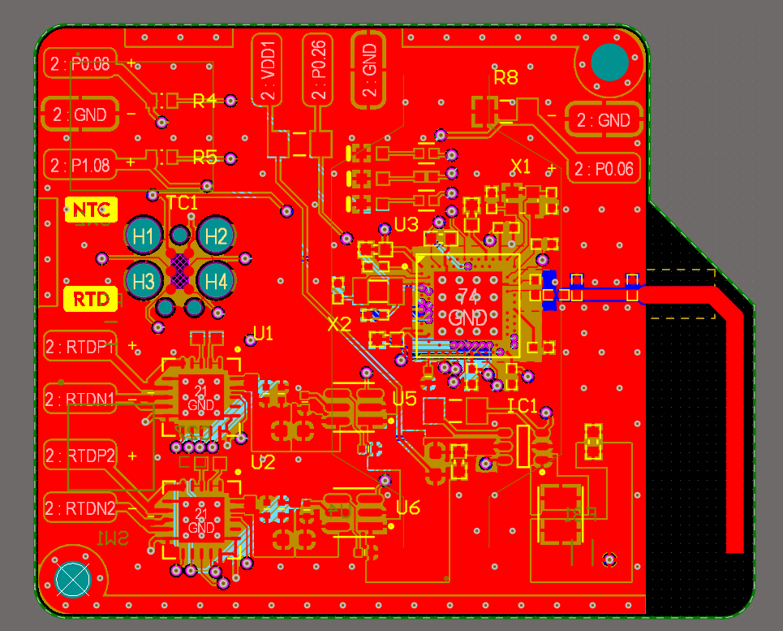

# PCB Description
This includes the design of a compact PCB (5cm x 4cm) to monitor the readings from thermistors and RTD temperature sensors along with integrating a heating element.
It also includes the design of a microstrip antenna for bluetooth data transmission.

## Components used
1. **Microcontroller**: nRF52840 BLE MCU (aQFN73 package)
2. **RTD to Digital IC**: MAX31865ATP+
3. **3V to 3.3V Boost converter**: ISL9111AEH33Z
4. **Power switches**: TPS22197DBVR
5. **Push button (Reset)**: FSM4JSMATR
6. **Switch**: WS-SLSV 450406
7. **CR2477 Battery holder**: SMTU2477N-LF
8. **Other generic components**: Crystals (XTALs), LEDs, Resistors, Capacitors and Inductors

## Layout
The PCB is designed as a 4-layer board with a custom stack-up derived from the recommended specifications of a well-known manufacturer. 
Trace widths are carefully calculated to achieve the desired 50 Ω transmission line impedance for the RF signals. 
All components are placed following recommended layout guidelines to ensure optimal performance. 
Appropriate decoupling capacitors are selected to minimize parasitic effects, and through-hole vias are distributed across the board to reduce return path distances.

## Debugging
A Tag-Connect (TC-2030) programming connector is used to conserve space on the board. It interfaces with an SWD debugger (such as an ST-LINK) for flashing firmware onto the microcontroller.
